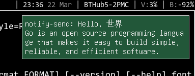

Tiny and lightweight notification daemon for Linux.
Implements the [freedesktop notification spec](https://developer.gnome.org/notification-spec/).
Massive WIP.

## screenshot

## todo

 - [x] draw notification in X window
 - [x] close popups automatically
 - [x] view all notifications
 - [x] support actions
 - [x] support hyperlinks
 - [x] render notifications properly
 - [ ] support push-based client to get no. of unread notifications
 - [ ] use one X window for all notifications
 - [x] config file
 - [x] refactor codebase
 - [ ] _maybe:_
   - [ ] sound support
   - [ ] icon support
   - [ ] italic / bold / underline rendering
